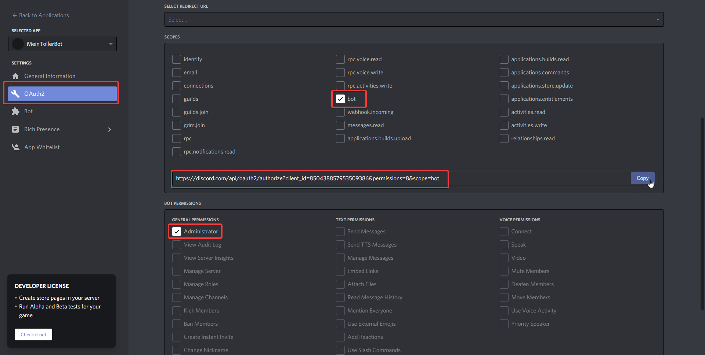
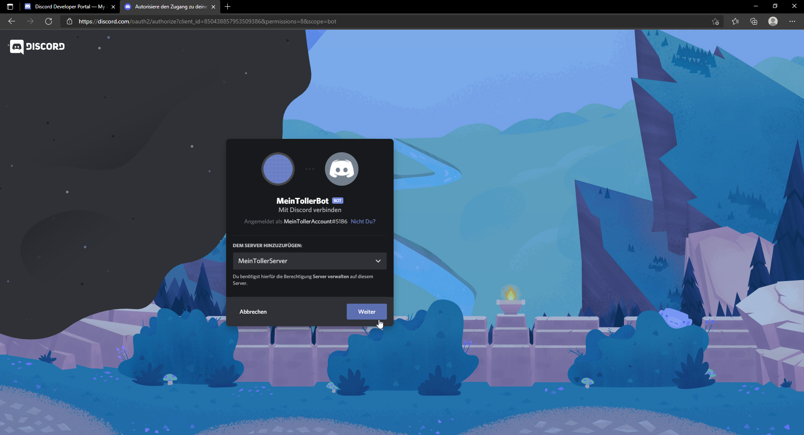
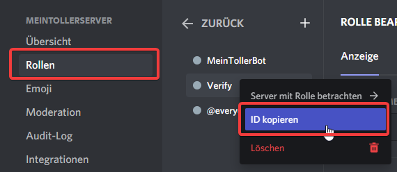

# Discord Bot

## Vorbereitung

### Discord Applikation

#### Schritt 1: Erstellen

Begib dich auf und erstelle eine Applikation

 (2) (2).png>)

#### Schritt 2: Name vergeben

#### Schritt 3: Bot erstellen

 (1).png>)

#### Schritt 4: Bot-Token kopieren


Speichere dir diesen Token ab! Wir brauchen diesen token Später


#### Schritt 5: Bot auf deinen Server einladen

Unter OAuth2 musst du nun bei `SCOPES` `bot` auswählen und unter `BOT PERMISSIONS` musst du `Administartor` auswählen. Nun kopierst du den Link, und öffnest ihn in einem neuen Tab

In diesem Fenster nun deinen Server auswählen, auf Weiter klicken und im nächsten Fenster Autorisieren auswählen.

Nun kannst du den Bot auf deinem Server betrachten

### Developer Modus

Damit du die Config richtig einstellen kannst, musst du bei deinem Discord den Developer Modus aktivieren.\
In deinen Einstellungen kannst du unter Erweitert den Entwickler-Modus aktivieren.

## Einrichtung der Config

### Connection

Unter connection findest du verschiedene Einstellmölichkeiten. \
**key** -  Hier gibst du den Key den du dir vorher kopiert hast an\
**status** - Hier gibst du den OnlineStatus des Bots an. (grüner, gelber oder roter Kreis) (Liste aller möglichen Status: [_JDA Wiki_](https://ci.dv8tion.net/job/JDA/javadoc/net/dv8tion/jda/api/OnlineStatus.html)_ _)\
**activity.type** - Hier gibst du die Art der Acitify an. (Spielt..., Guckt.., etc...) (Liste aller möglichen Typs: [_JDA Wiki_](https://ci.dv8tion.net/job/JDA/javadoc/net/dv8tion/jda/api/entities/Activity.ActivityType.html) )\
**activity.value** - Die aktivität die angezeigt wird nach dem Typ. Bspw. \[Spiel] verifizieren\
**guild** - Guild steht hier für deinen Discord-Server. Hier musst du die ID deiner Guilde angeben. Diese erhälst du indem du Rechtsklick auf dein Server-Icon machst, und dort die ID kopierst

 (1).png>)

### Verifikation

**command** - Hier gibst du den Befehl ein, mit dem sich Spieler verifizieren Können. Bei !link können sich Spieler dann mit `!link <Code>` verifizieren\
**channel** - Die ID des Channels in dem sich spieler verifizieren können. Diese erhälst du indem du Rechtsklick auf den Channel machst, und dort ID kopieren auswälst. (Wie beim Guild)\
**deleteAllMessages** - Wenn du hier true angibst, werden alle Nachrichten die in diesen Channel geschrieben werden automatisch gelöscht.\
\
_**groups**_ - Hier kannst du Einstellen, ob und welche Gruppen beim verifizieren vergeben werden.\
**verify** - Diese Gruppe wird jedem der sich verifiziert gegeben, egal welchen Rang er hat.\
**apply** de/aktiviert diese Funktion.\
**id** gibt die id der Rolle an. Diese erhälst du indem bei in den Rollen Einstellungen in der Servereinstellungen einen Rechtsklick auf die Rolle machst, und dort ID kopieren auswählst:

**roles** -  Vergibt Rollen je nach einer Permission die ein spieler haben muss.\
**apply** - de/aktiviert diese Funktion\
**id** - Eine Liste von permissions und der dazugehörigen Rollen-ID (siehe oben). Format: `permssion:Rollen-ID`. 

### Notify & Report

Wenn du Notify antiwierst erhälst du in deinem Discord immer wenn jemand einen **Spieler bannt** eine Nachricht in einen angegebenen Channel.

Wenn du Report aktivierst, wehälst du in deinem Discord immer wenn jemand einen **Spieler reported** einen Nachricht in einen angegebenen Channel.

Du musst bei beidem den Channel als ID angeben. Die ID gibst du genauso wie bei dem Channel von der [Verifikation](discord-bot.md#verifikation) an.
